# SBOM Play - Application Flow Documentation

This document provides comprehensive flowcharts documenting how SBOM Play performs each action. All flows are documented using Mermaid syntax for easy visualization.

## Table of Contents

1. [Application Initialization Flow](#application-initialization-flow)
2. [Single Repository Analysis Flow](#single-repository-analysis-flow)
3. [Organization/User Analysis Flow](#organizationuser-analysis-flow)
4. [SBOM Processing Flow](#sbom-processing-flow)
5. [Vulnerability Analysis Flow](#vulnerability-analysis-flow)
6. [Author Analysis Flow](#author-analysis-flow)
7. [License Compliance Analysis Flow](#license-compliance-analysis-flow)
8. [Storage Operations Flow](#storage-operations-flow)
9. [View Rendering Flow](#view-rendering-flow)
10. [Rate Limit Handling Flow](#rate-limit-handling-flow)

---

## Application Initialization Flow

The application initialization process sets up all components and prepares the UI for user interaction.

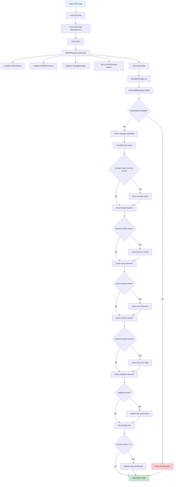

**Key Components:**
- **SBOMPlayApp**: Main application class that orchestrates all operations
- **StorageManager**: Handles IndexedDB operations for persistent storage
- **GitHubClient**: Manages GitHub API interactions with rate limit handling
- **SBOMProcessor**: Processes and analyzes SBOM data

---

## Single Repository Analysis Flow

When a user analyzes a single repository, the application fetches and processes its SBOM data.

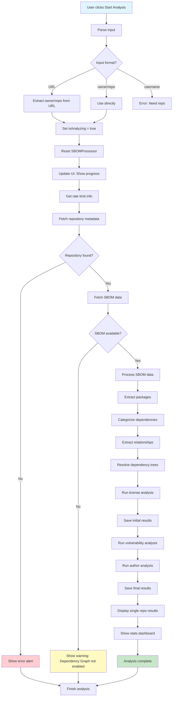

**Key Steps:**
1. Parse user input (supports URLs, owner/repo format, or username)
2. Fetch repository metadata from GitHub API
3. Fetch SBOM data using Dependency Graph API
4. Process and categorize dependencies
5. Resolve full dependency trees with registry APIs
6. Run license compliance analysis
7. Save initial results to storage
8. Run vulnerability analysis with incremental saving
9. Run author analysis
10. Save final results and display using `displaySingleRepoResults`

---

## Organization/User Analysis Flow

When analyzing an organization or user, the application processes multiple repositories with incremental saving.

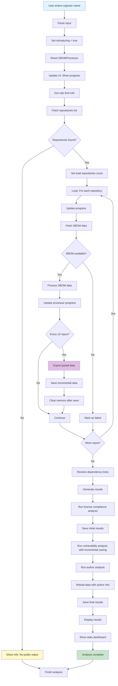

**Key Features:**
- **Incremental Saving**: Data is saved every 10 repositories to prevent data loss
- **Memory Management**: Memory is cleared after incremental saves to prevent DOM issues
- **Progress Tracking**: Real-time progress updates for each repository
- **Error Handling**: Failed repositories are tracked but don't stop the analysis

---

## SBOM Processing Flow

The SBOM processor extracts, categorizes, and analyzes dependency information from GitHub SBOM data.

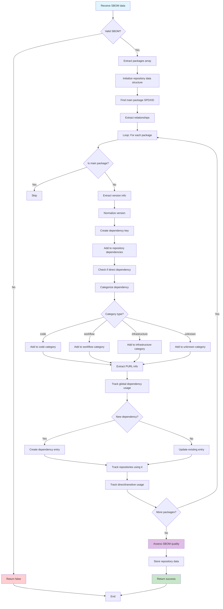

**Key Operations:**
- **Version Normalization**: Removes comparison operators (>=, <=, ^, ~)
- **Dependency Categorization**: Classifies as code, workflow, or infrastructure
- **Relationship Tracking**: Identifies direct vs transitive dependencies
- **Quality Assessment**: Evaluates SBOM completeness and quality

---

## Vulnerability Analysis Flow

The vulnerability analysis queries OSV.dev API to identify security vulnerabilities in dependencies.

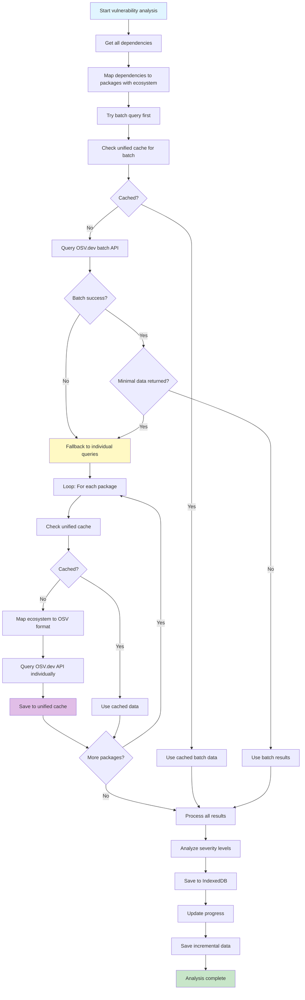

**Key Features:**
- **Batch Processing**: Tries batch query first (up to 100 packages), falls back to individual queries if minimal data returned
- **Caching**: Uses unified cache manager to avoid redundant API calls
- **Ecosystem Mapping**: Maps internal ecosystem names to OSV.dev format using PURL extraction
- **Incremental Saving**: Saves results incrementally during analysis
- **Severity Analysis**: Categorizes vulnerabilities by severity (CRITICAL, HIGH, MEDIUM, LOW)

---

## Author Analysis Flow

The author analysis fetches package author information from multiple sources and identifies funding opportunities.

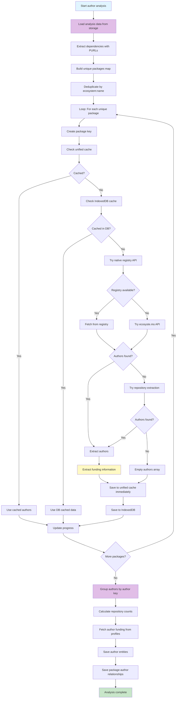

**Data Sources (Priority Order):**
1. **Native Registries**: npm, PyPI, Cargo, NuGet, RubyGems (most reliable)
2. **ecosyste.ms**: Fallback API for package metadata
3. **Repository Extraction**: Extract owners from repository URLs

**Key Features:**
- **Storage-First**: Loads analysis data from IndexedDB before starting
- **PURL-Based Extraction**: Extracts packages using PURL information from dependencies
- **Package Deduplication**: Deduplicates by ecosystem:name before fetching
- **Multi-source Fetching**: Tries multiple sources for maximum coverage
- **Funding Detection**: Identifies GitHub Sponsors, Open Collective, Patreon, Tidelift (both package and author level)
- **Author Grouping**: Groups authors by author key and calculates repository counts
- **Incremental Caching**: Saves immediately after fetching each package to unified cache and IndexedDB

---

## License Compliance Analysis Flow

The license processor analyzes license information and identifies compliance risks.

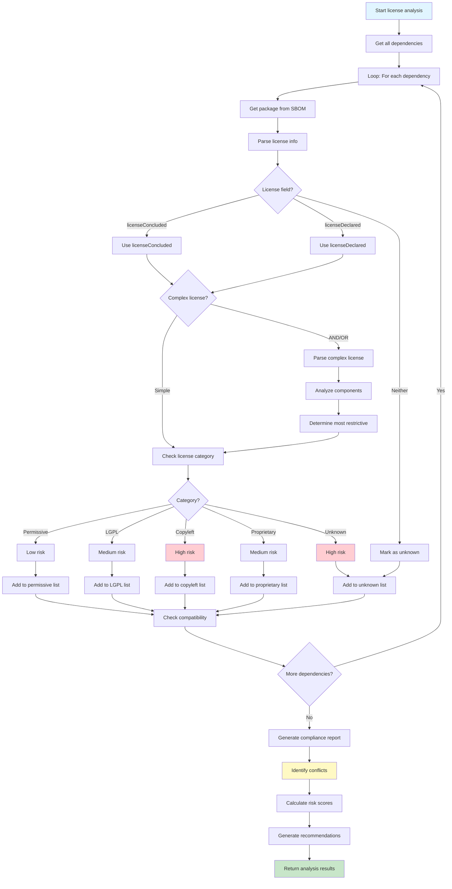

**License Categories:**
- **Permissive**: MIT, Apache, BSD (low risk)
- **LGPL**: Lesser GPL licenses (medium risk)
- **Copyleft**: GPL, AGPL, MPL (high risk)
- **Proprietary**: Commercial licenses (medium risk)
- **Unknown**: Unspecified licenses (high risk)

**Key Features:**
- **Complex License Parsing**: Handles AND/OR combinations
- **Compatibility Checking**: Validates license compatibility matrix
- **Risk Assessment**: Categorizes licenses by compliance risk
- **Conflict Detection**: Identifies incompatible license combinations

---

## Storage Operations Flow

The storage manager handles all IndexedDB operations for persistent data storage.

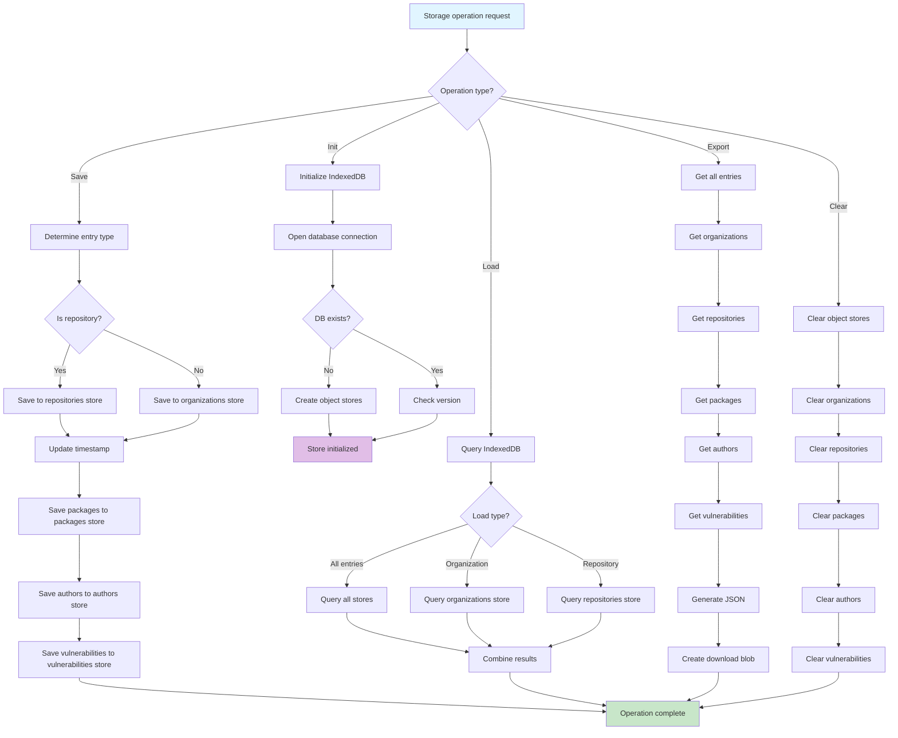

**Object Stores:**
- **organizations**: Organization/user analysis data
- **repositories**: Individual repository data
- **packages**: Package metadata and relationships
- **authors**: Author entities with deduplication
- **vulnerabilities**: Vulnerability scan results
- **packageAuthors**: Package-author relationships

**Key Features:**
- **Incremental Saving**: Supports partial data saves during analysis
- **Type Detection**: Auto-detects organization vs repository entries
- **Export/Import**: Full data export with checksum validation
- **Storage Management**: Tracks usage and provides cleanup options

---

## View Rendering Flow

The view manager handles rendering of analysis results across different pages.

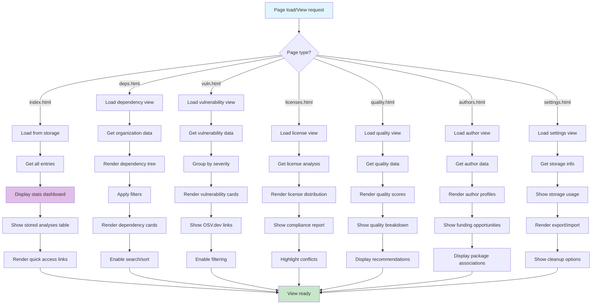

**View Components:**
- **Statistics Dashboard**: Overview metrics and charts
- **Dependency Views**: Tree visualization and filtering
- **Vulnerability Views**: Severity-based grouping and filtering
- **License Views**: Distribution charts and compliance reports
- **Quality Views**: Score breakdowns and recommendations
- **Author Views**: Profiles with funding opportunities

---

## Rate Limit Handling Flow

The GitHub client handles rate limiting automatically with state persistence.

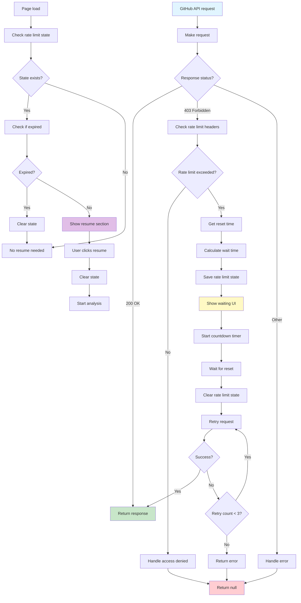

**Rate Limit Features:**
- **Automatic Handling**: Detects and waits for rate limit resets
- **State Persistence**: Saves state to localStorage for resume capability
- **User Notification**: Shows countdown timer and reset time
- **Resume Support**: Allows resuming interrupted analyses

---

## Data Flow Overview

This diagram shows how data flows through the entire application.

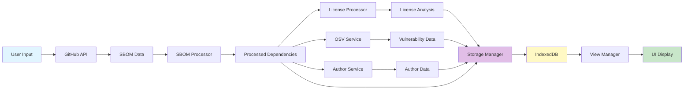

---

## Key Design Patterns

1. **Incremental Processing**: Large analyses are broken into chunks with incremental saves
2. **Caching Strategy**: Multi-layer caching (unified cache, IndexedDB, in-memory)
3. **Error Resilience**: Failed operations don't stop entire analysis
4. **State Persistence**: Rate limit and analysis state saved for recovery
5. **Modular Architecture**: Separate processors for different analysis types
6. **Client-Side Only**: All processing happens in the browser for privacy

---

## Notes

- All API calls respect rate limits and include retry logic
- Data is saved incrementally to prevent loss during long analyses
- Cache is checked before making external API calls
- Storage operations are asynchronous and non-blocking
- UI updates happen progressively as data becomes available

