# SBOM Play - Workflow Documentation

## Project Overview

SBOM Play is a client-side web application for analyzing Software Bill of Materials (SBOM) data from GitHub repositories, organizations, and users. The application provides comprehensive dependency analysis, vulnerability scanning, license compliance checking, and organizational insights.

## Architecture Overview

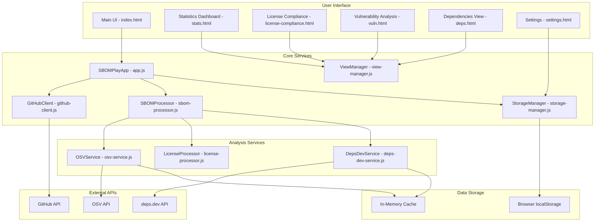

## Main Application Flow

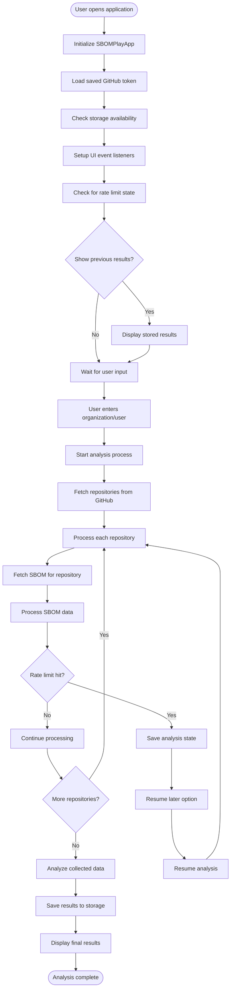

## GitHub API Integration Flow

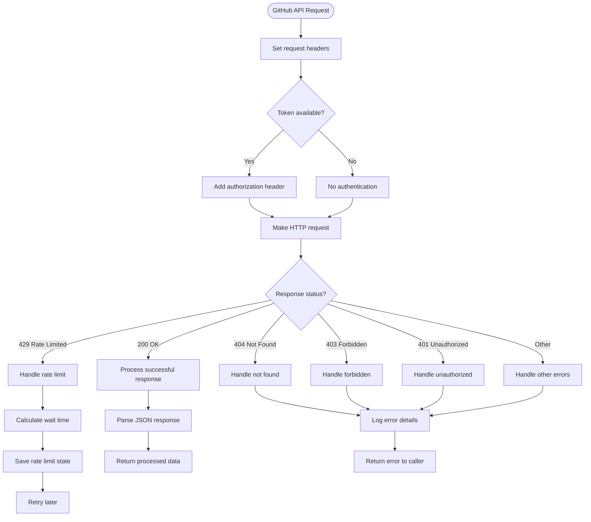

## SBOM Processing Flow

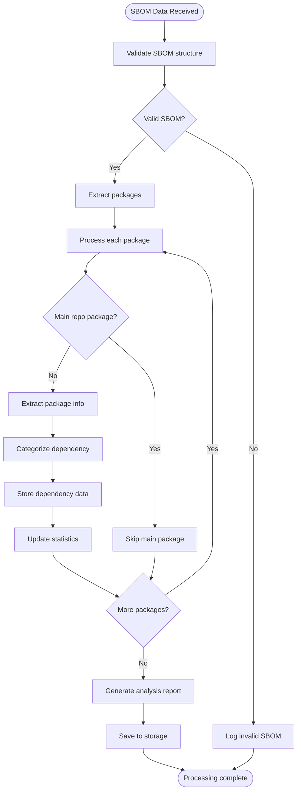

## Storage Management Flow

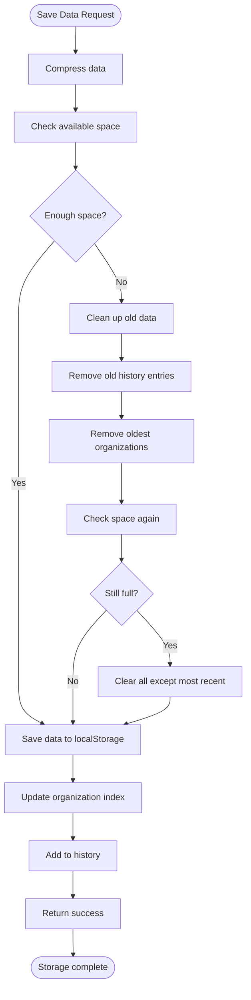

## Vulnerability Analysis Flow

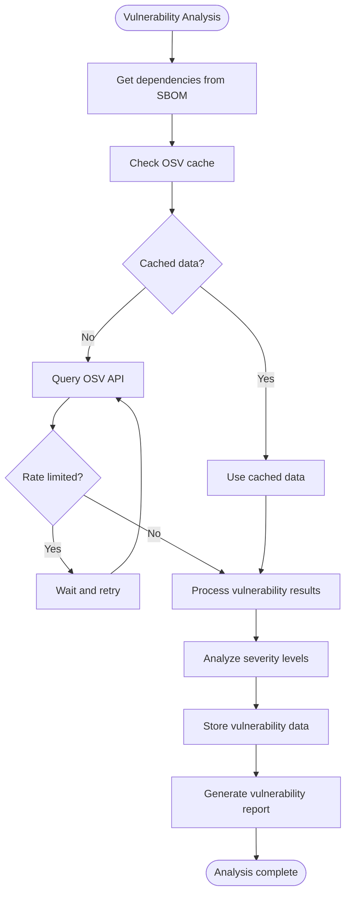

## License Compliance Flow

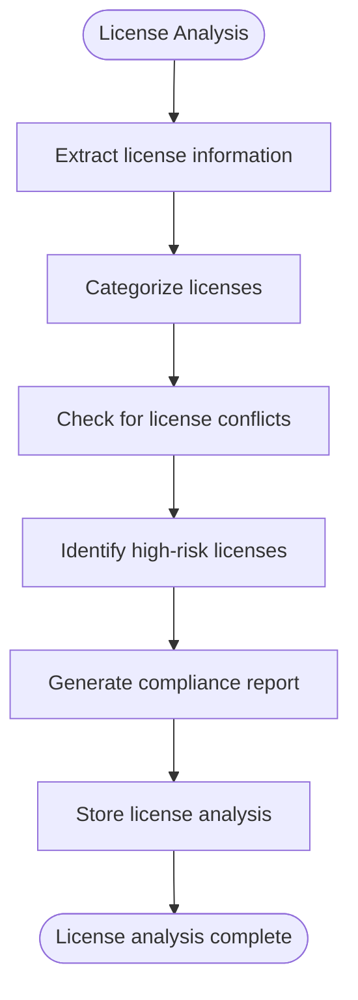

## View Management Flow

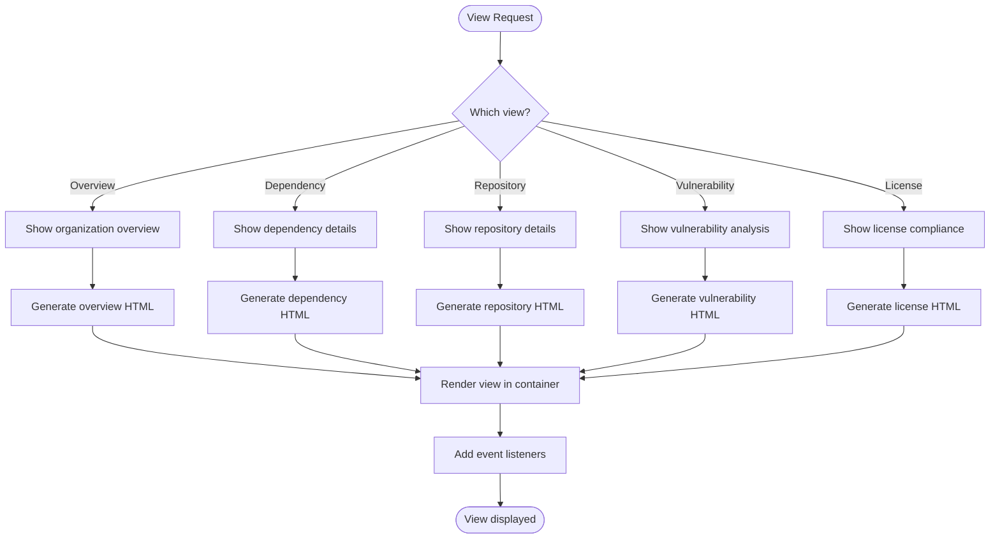

## DepsDev Integration Flow

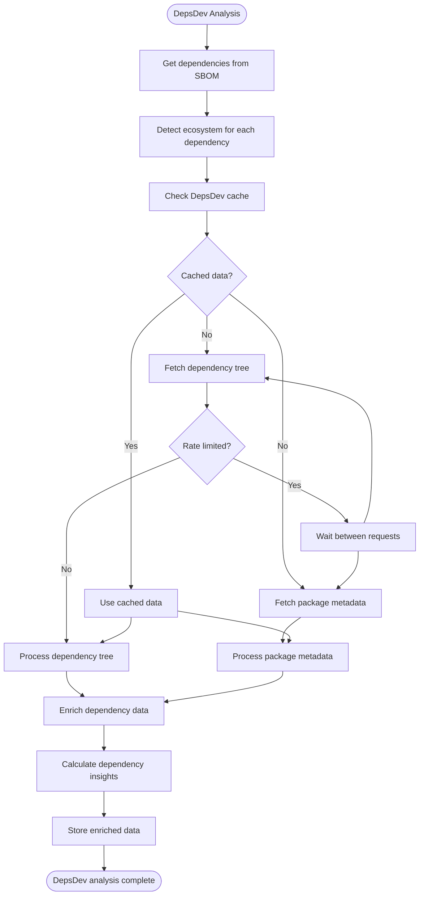

## Data Flow Architecture

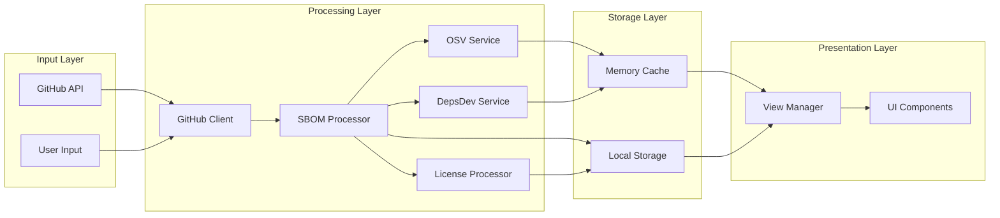

## Error Handling Flow

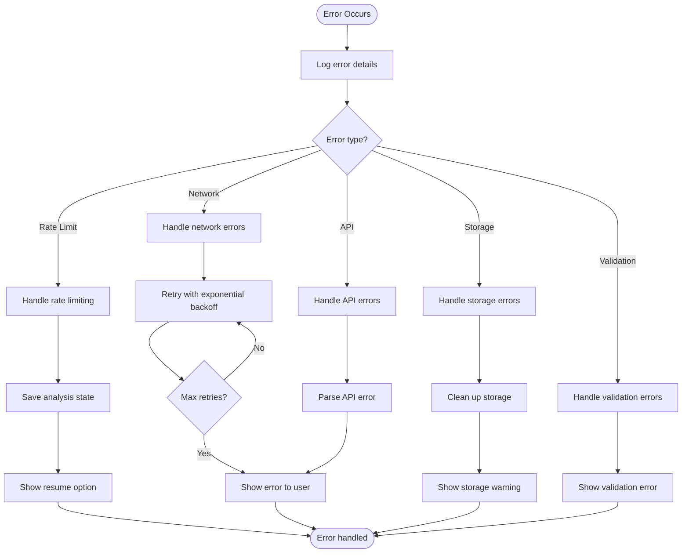

## Component Dependencies

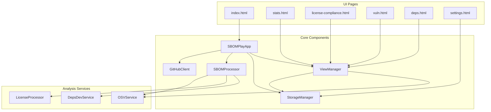

## Performance Optimization Flow

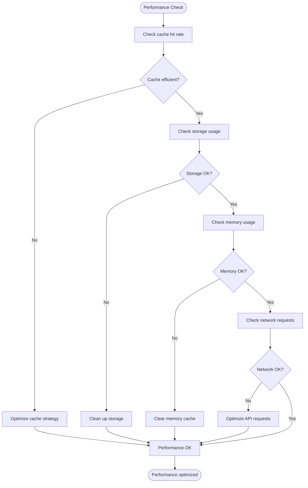

This workflow documentation provides a comprehensive view of how SBOM Play processes data, handles errors, manages storage, and delivers insights to users. Each flowchart represents a specific aspect of the application's functionality and can be used for understanding, debugging, or extending the system. 